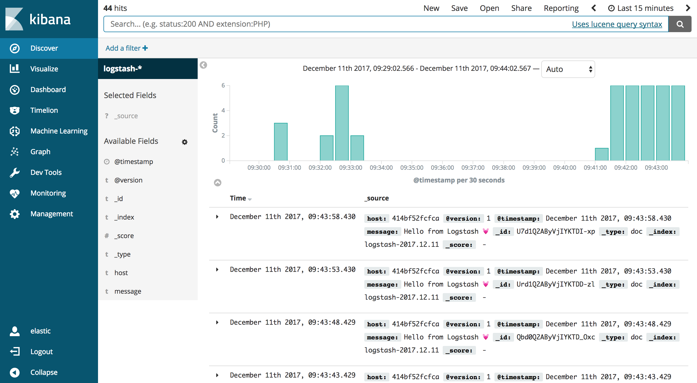
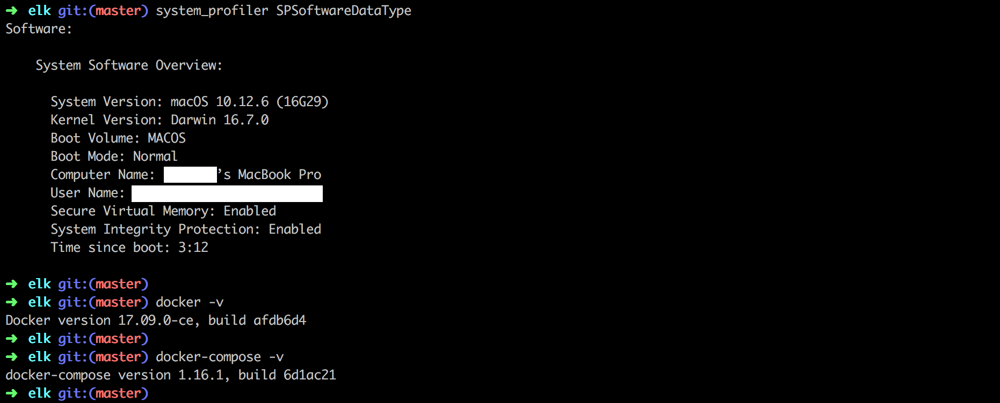

# Elasticsearch + Logstash + Kibana Stack

Run the latest version of the ELK (Elasticsearch, Logstash, Kibana) stack with Docker and Docker Compose.
All docker images is provided at [here](https://www.docker.elastic.co/).

## Setup

```sh
$ git clone git@github.com:euclid1990/elk.git /path_to_project
$ cd /path_to_project
$ docker-compose up
```

**Note**: If you using Ubuntu/Linux, you may need to change the permissions of folder:

```sh
sudo chmod -R 777 /path_to_project/data
```

## Accessing Kibana
Kibana is a web application that you access through port 5601. Go to url: http://localhost:5601 with login information:

```
Username: elastic
Password: MyPwd123
```



## Exploring Your Cluster

Using cURL in the [Console](http://localhost:5601/app/kibana#/dev_tools/console?_g=()) to:

#### Cluster Health

```
GET /_cat/health?v
```

#### List All Indices

```
GET /_cat/indices?v
```

#### Exploring Logstash Data

```
GET /logstash-*/_search?q=*&sort=@timestamp:desc&pretty
```

## Testing Environment



## References:

- [Elasticsearch Document](https://www.elastic.co/guide/en/elasticsearch/reference/current/index.html)
- [Kibana Document](https://www.elastic.co/guide/en/kibana/current/index.html)
- [Logstash Document](https://www.elastic.co/guide/en/logstash/current/index.html)
- [Install Elasticsearch with Docker](https://www.elastic.co/guide/en/elasticsearch/reference/current/docker.html)
- [The Search API](https://www.elastic.co/guide/en/elasticsearch/reference/current/_the_search_api.html)
